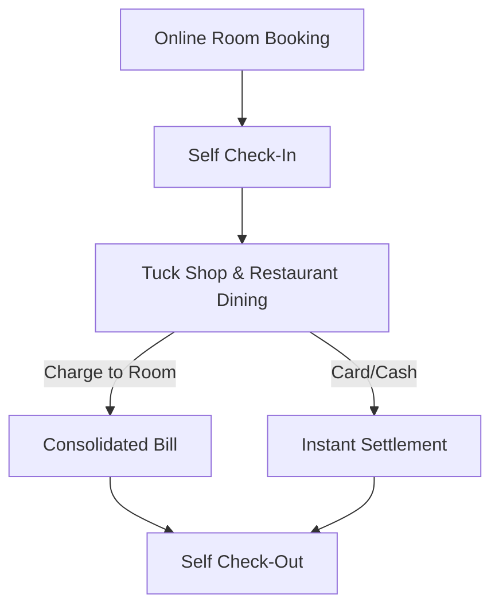

# stayFlow: The Next-Generation Guest Experience & Hotel Management Platform

**A Tailored Proposal for Premium Hotel Properties**

---

## Executive Summary

In today’s hospitality landscape, guest expectations are higher than ever. Guests demand instant, friction-free experiences—from booking their stay to ordering dinner. Yet, many hotels operate with fragmented, legacy systems where front desk management, housekeeping, kitchen dining, and tuck shops run in silos.

**stayFlow** is a unified, elite Hotel Management System (HMS) designed to bridge these gaps. It integrates front desk operations, guest self-service, staff dispatching, and dining e-commerce into a single cohesive platform. 

By deploying **stayFlow**, your property will:
1. **Elevate Guest Satisfaction**: Offer self-service room bookings, digital check-ins/check-outs, and instant order tracking.
2. **Drive Ancillary Revenue**: Seamlessly monetize food, beverage, and retail services with room-charge integration.
3. **Optimize Staff Efficiency**: Empower housekeeping and kitchen teams with dedicated, real-time tracking dashboards.
4. **Maintain Absolute Control**: Access global branding settings, financial analytics, and robust role-based security under one roof.

---

## The stayFlow Experience: A Seamless Guest Journey

Here is how **stayFlow** transforms a standard guest stay into a premium, luxury experience:

1. **Before Arrival**: The guest visits your custom portal, selects their room class, enters booking dates, applies any active coupon codes, and secures their reservation instantly.
2. **At Check-In**: No long queues. The guest performs a self-check-in on their mobile device or is greeted at the front desk by a receptionist using the intuitive walk-in booking interface.
3. **During the Stay**:
   - Guests scan a QR code to access your digital Tuck Shop and Restaurant menu.
   - They add items to their cart and choose to **Charge to Room** (instantly verified against their checked-in booking status) or pay via card/cash.
   - The kitchen team receives the order instantly on their kitchen dashboard and updates the preparation status.
4. **At Check-Out**: The guest completes check-out digitally, with all dining charges automatically consolidated onto their final invoice.

---

## Core Platform Capabilities

### 1. Advanced Front Desk & Room Management
* **Dynamic Room Grid**: Easily manage rooms, clean/dirty housekeeping states, and availability.
* **Smart Walk-In Billing**: Receptionists can book walk-in guests, log payments, process check-ins, and schedule check-outs in under 60 seconds.
* **Coupon & Promotions Engine**: Create custom discount codes to drive direct booking volumes during off-peak seasons.

### 2. Digital Restaurant & Retail E-Commerce
* **Mobile-First Ordering**: A fluid, responsive catalog experience for your restaurant and retail shops.
* **Flexible Delivery Modes**: Support room delivery (requiring room number input), table-side takeaway, or direct address delivery.
* **Charge-to-Room Validation**: Automatic background verification ensuring only active, checked-in guests can place orders to their room bill, preventing fraud.

### 3. Dedicated Staff & Kitchen Dashboards
* **Housekeeping App**: Cleaners clock-in for their shifts and instantly update room preparation statuses, syncing directly with the front desk.
* **Kitchen Order Tracker**: Chefs view active orders, organize them by category, and update preparation statuses (pending, preparing, ready, completed) to keep guests informed.

### 4. Enterprise-Grade Administration & Security
* **Branding Customizer**: Adjust the system's primary and secondary HSL color tokens to match your hotel's exact visual identity in both light and dark modes.
* **Guest Blacklisting**: Protect your property and staff by flagging or blacklisting problematic past guests.
* **Financial Analytics & Exporting**: Generate comprehensive revenue reports and export data to CSV/Excel for seamless accounting.

---

## The Business Case: Why stayFlow Pays for Itself

| Feature | Legacy Approach | stayFlow Advantage | Financial Impact |
| :--- | :--- | :--- | :--- |
| **Room Ordering** | Printed paper menus; manual phone orders. | Instant digital catalogs with one-tap checkout. | **+18%** average order size due to visual upselling. |
| **Check-In/Out** | Queues at front desk during peak check-in hours. | Self-service check-in/out on guest mobile. | **-35%** administrative overhead at reception. |
| **Housekeeping** | Staff running around floor-to-floor with clipboards. | Instant digital status sync via mobile dashboard. | **+25%** faster room turnaround times. |
| **Payment Leakage** | Manual entries of restaurant bills onto room accounts. | Auto-incrementing room bills on booking. | **Zero** missed charges at check-out. |

---

## Technical Superiority & Integration

**stayFlow** is engineered using modern, secure, and lightning-fast standard architectures:
* **High Performance**: Renders completely server-side via PHP/Laravel to guarantee search engines can index your public booking pages (maximizing SEO).
* **Responsive Styling System**: Beautiful, hardware-accelerated CSS and modern glassmorphic design paradigms create a premium, high-end feel.
* **Ironclad Security**: Built-in protection against CSRF, SQL Injection, and Cross-Site Scripting (XSS), combined with strict role-based access control (RBAC).

---

## Implementation & Support Plan

We partner with your team at every stage of the rollout to guarantee a successful deployment:

1. **Brand Alignment (Week 1)**: Configure the platform with your hotel's colors, logo, room types, dynamic pricing models, and menu items.
2. **Onboarding & Training (Week 2)**: Provide hands-on walkthroughs for front-desk receptionists, kitchen staff, and housekeepers.
3. **Go-Live & Integration (Week 3)**: Deploy to your secure server and link to your domain.
4. **Ongoing Support**: 24/7 technical monitoring, automated daily backups, and regular feature updates.

---

## Contact Us to Schedule a Live Demo

Are you ready to unlock new revenue streams and streamline your property's daily operations? Let's arrange a 15-minute interactive walkthrough. We will set up a sandbox instance customized with your hotel's name and brand guidelines so your team can experience the **stayFlow** difference firsthand.

* **Website**: [stayflow.com](https://stayflow.com)
* **Email**: sales@stayflow.com
* **Phone**: +1 (800) 555-FLOW
